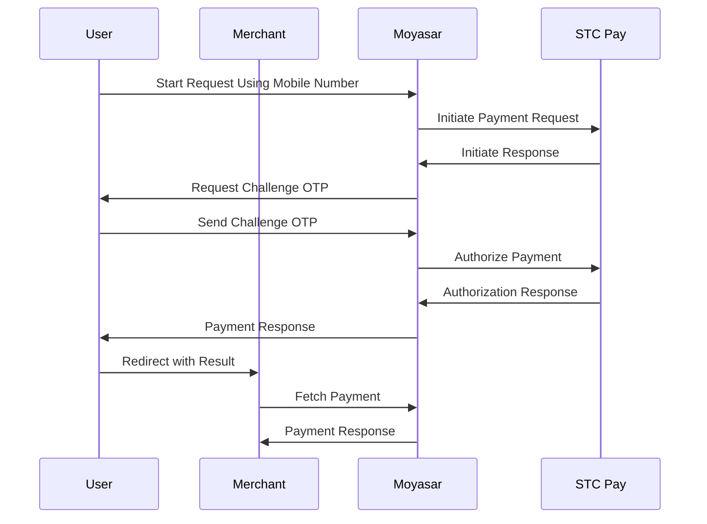

import { FormLinksCodeBlock } from '../../../src/components/FormLinksCodeBlock';
import { LoadFormScript } from '../../../src/components/LoadFormScript';
import { SampleForm } from '../../../src/components/SampleForm';

<LoadFormScript />

# STC Pay Basic Integration

This page will guide you to accept STC Pay wallet payments using our Payment Form Javascript library.

## Before Starting

Before you start accepting credit/debit card payments, make sure you complete these steps first:

1. Sign up for a Moyasar account on our [dashboard.](https://dashboard.moyasar.com/register/new)
2. [Get your publishable API key ](/guides/dashboard/get-your-api-keys)to authenticate your form payment requests.
3. Get the **merchant ID** from STC Pay's merchant portal.
4. Request the STC Pay feature from your account manager in Moyasar and provide them your **merchant ID** to activate the service or contact us at [care@moyasar.com](mailto:care@moyasar.com)

## Including Moyasar Form

Moyasar Form is a lightweight Javascript library that will take care of creating the payment components within your
website using a modern and responsive design.

You can start the integration by including the following tags within the `<head>` tag of your page:

<FormLinksCodeBlock />

## Initiating the Payment Form

Once you decide on a good place for the form, add an empty `<div>` tag and then invoke the `init` method on the global `Moyasar` class.

```html title="HTML"
<div class="mysr-form"></div>
<script>
  window.Moyasar.init({
    element: '.mysr-form',
    // Amount in the smallest currency unit.
    // For example:
    // 10 SAR = 10 * 100 Halalas
    // 10 KWD = 10 * 1000 Fils
    // 10 JPY = 10 JPY (Japanese Yen does not have fractions)
    amount: 1000,
    currency: 'SAR',
    description: 'Coffee Order #1',
    publishable_api_key: 'pk_test_AQpxBV31a29qhkhUYFYUFjhwllaDVrxSq5ydVNui',
    callback_url: 'https://moyasar.com/thanks',
    methods: ['stcpay'],
  });
</script>
```

## Payment Form

<SampleForm config={{ methods: ['stcpay'] }} />

## STC Pay Payment Lifecycle



## Save Payment ID

This step is optional but **highly recommended** to save the payment ID, which grants you the ability to verify payment details in case your user's connection drops.

To save the payment ID you can provide the **on_completed** configuration option with an async function.

```javascript title="JS"
Moyasar.init({
  element: '.mysr-form',
  amount: 1000,
  currency: 'SAR',
  description: 'Coffee Order #1',
  publishable_api_key: 'pk_test_AQpxBV31a29qhkhUYFYUFjhwllaDVrxSq5ydVNui',
  methods: ['stcpay'],
  on_completed: async function (payment) {
    await savePaymentOnBackend(payment);
  },
});
```

The method `savePaymentOnBackend` is a placeholder, and you must provide your own custom logic.

## Step 4: Verify Payment

Once the user has completed the payment and got redirected to your website or app using the `callback_url`
you provided earlier, the following HTTP query parameters will be appended:

- `id`
- `status`
- `message`

Here is an example:

```http request title="Callback URL"
https://www.my-store.com/payments_redirect?id=79cced57-9deb-4c4b-8f48-59c124f79688&status=paid&message=Succeeded
```

Now fetch the payment using its **id** through our [fetch API](/api/payments/02-fetch-payment.api.mdx), and verify
its `status`, `amount`, and `currency` before accepting your user's order or completing any business action.

Next, just show success or failure according to the previous validation.
