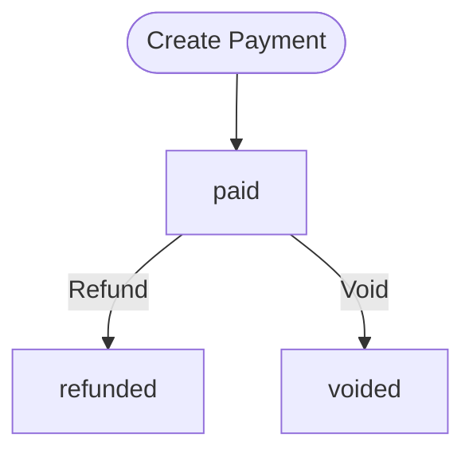
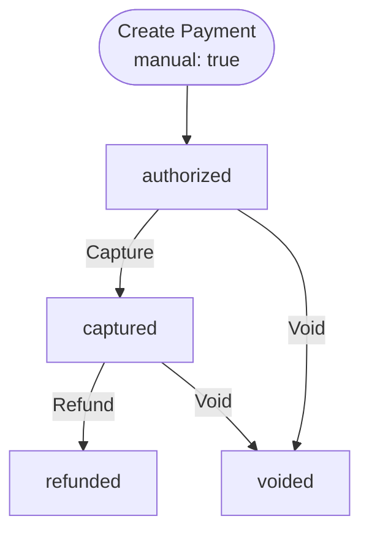
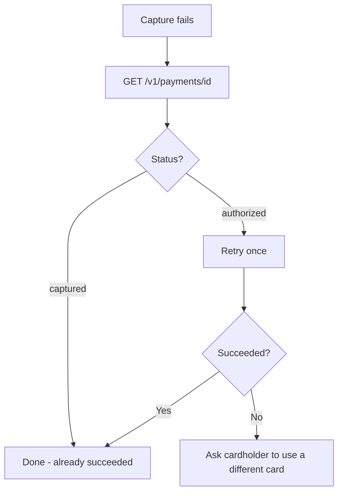
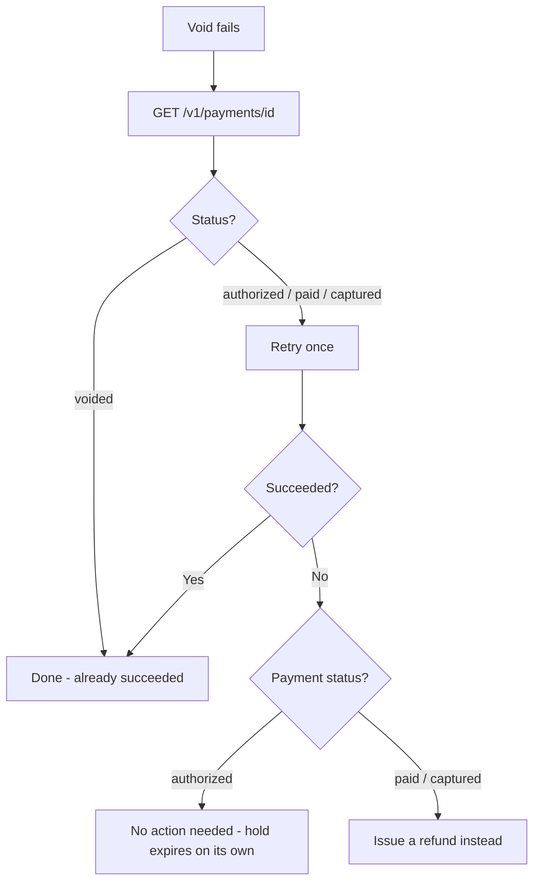
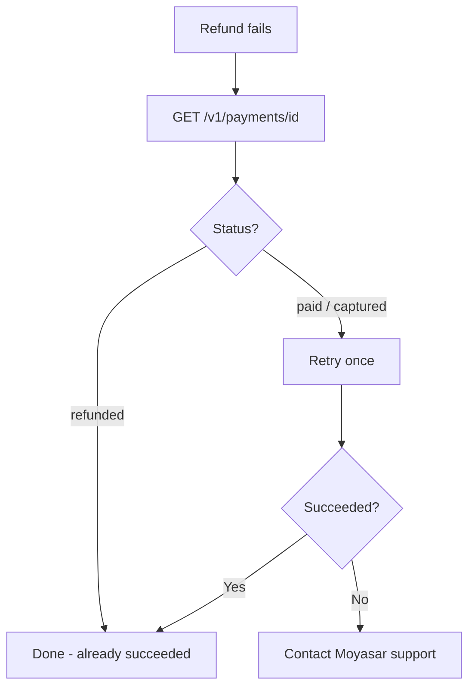

import Tabs from '@theme/Tabs';
import TabItem from '@theme/TabItem';

# Payment Flows

Moyasar supports two payment flows:

#### 1. Purchase (default)

Authorizes and captures in one step. The card is charged immediately and the payment status is `paid`.

<div style={{display: 'flex', justifyContent: 'center'}}>



</div>

#### 2. Authorization

Only places a hold on the card without capturing the funds. You then decide whether to capture (charge) or void (release) the held amount.

<div style={{display: 'flex', justifyContent: 'center'}}>



</div>

---

## Authorization

To authorize a payment without charging, set `manual` to `true` in the source when creating the payment.

**Endpoint:** `POST /v1/payments`

**Authentication:** Publishable key

<Tabs>
<TabItem value="json" label="JSON" default>

```json title="POST /v1/payments"
{
  "amount": 5000,
  "currency": "SAR",
  "description": "Order #1234",
  "callback_url": "https://example.com/callback",
  "source": {
    "type": "creditcard",
    "name": "John Doe",
    "number": "4111111111111111",
    "month": "01",
    "year": "2027",
    "cvc": "123",
    "manual": true
  }
}
```

</TabItem>
<TabItem value="curl" label="cURL">

```bash title="POST /v1/payments"
curl -X POST https://api.moyasar.com/v1/payments \
  -u pk_test_YOUR_PUBLISHABLE_KEY: \
  -H "Content-Type: application/json" \
  -d '{
    "amount": 5000,
    "currency": "SAR",
    "description": "Order #1234",
    "callback_url": "https://example.com/callback",
    "source": {
      "type": "creditcard",
      "name": "John Doe",
      "number": "4111111111111111",
      "month": "01",
      "year": "2027",
      "cvc": "123",
      "manual": true
    }
  }'
```

</TabItem>
</Tabs>

The response will have `"status": "authorized"` instead of `"paid"`.

:::warning[Capture Window]
Authorized payments must be captured within **14 days** on the **Mada** scheme. Other card schemes (Visa, Mastercard, etc.) may allow longer capture windows. If you do not capture or void in time, the hold will eventually expire and the funds will be released back to the cardholder.
:::

---

## Capture

Captures an authorized payment, charging the cardholder.

**Endpoint:** `POST /v1/payments/{id}/capture`

**Authentication:** Secret key

### Full Capture

```bash title="POST /v1/payments/{id}/capture"
curl -X POST https://api.moyasar.com/v1/payments/{payment_id}/capture \
  -u sk_test_YOUR_SECRET_KEY:
```

No request body is needed. The full authorized amount is captured.

### Partial Capture

To capture less than the authorized amount, pass the `amount` parameter (in the smallest currency unit).

<Tabs>
<TabItem value="json" label="JSON" default>

```json title="POST /v1/payments/{id}/capture"
{
  "amount": 3000
}
```

</TabItem>
<TabItem value="curl" label="cURL">

```bash title="POST /v1/payments/{id}/capture"
curl -X POST https://api.moyasar.com/v1/payments/{payment_id}/capture \
  -u sk_test_YOUR_SECRET_KEY: \
  -H "Content-Type: application/json" \
  -d '{ "amount": 3000 }'
```

</TabItem>
</Tabs>

- Capture amount cannot exceed the authorized amount.
- The payment status changes to `captured`.

---

## Void

Releases the hold on an authorized payment, or reverses a paid/captured payment.

**Endpoint:** `POST /v1/payments/{id}/void`

**Authentication:** Secret key

```bash title="POST /v1/payments/{id}/void"
curl -X POST https://api.moyasar.com/v1/payments/{payment_id}/void \
  -u sk_test_YOUR_SECRET_KEY:
```

No request body is needed. The payment status changes to `voided`.

:::warning[Void window]
- **Authorized payments** — can be voided within **14 days** on the **Mada** scheme. Other card schemes may allow a longer window. If not voided in time, the issuer will automatically release the held funds back to the cardholder.
- **Paid/captured payments** — can only be voided within approximately **2 hours** of the original transaction. After that, use a refund instead.
:::

:::tip
Prefer void over refund when possible. Voids release the hold instantly and avoid processing fees.
:::

---

## Refund

Returns funds to the cardholder for a charged payment.

**Endpoint:** `POST /v1/payments/{id}/refund`

**Authentication:** Secret key

### Full Refund

```bash title="POST /v1/payments/{id}/refund"
curl -X POST https://api.moyasar.com/v1/payments/{payment_id}/refund \
  -u sk_test_YOUR_SECRET_KEY:
```

No request body is needed. The full charged amount is refunded.

### Partial Refund

To refund less than the charged amount, pass the `amount` parameter (in the smallest currency unit).

<Tabs>
<TabItem value="json" label="JSON" default>

```json title="POST /v1/payments/{id}/refund"
{
  "amount": 2000
}
```

</TabItem>
<TabItem value="curl" label="cURL">

```bash title="POST /v1/payments/{id}/refund"
curl -X POST https://api.moyasar.com/v1/payments/{payment_id}/refund \
  -u sk_test_YOUR_SECRET_KEY: \
  -H "Content-Type: application/json" \
  -d '{ "amount": 2000 }'
```

</TabItem>
</Tabs>

- Refund amount cannot exceed the charged amount.
- For `paid` payments, the maximum refundable amount is the full `amount`.
- For `captured` payments, the maximum refundable amount is the `captured` amount.
- The payment status changes to `refunded`.
- For live accounts using aggregation, your account balance must be sufficient to cover the refund.

---

## Handling Failures

### Capture Failure

1. Check the payment status via `GET /v1/payments/{id}`.
2. If still `authorized`, retry the capture once.
3. If it fails again, ask the cardholder to use a different card and create a new payment.



### Void Failure

1. Check the payment status via `GET /v1/payments/{id}`.
2. If still voidable, retry the void once.
3. If it fails again:
   - **Authorized payments:** No action needed. The hold will expire on its own and the funds will return to the cardholder.
   - **Paid/captured payments:** Issue a refund instead.



### Refund Failure

1. Check the payment status via `GET /v1/payments/{id}`.
2. If still `paid` or `captured`, retry the refund once.
3. If it fails again, contact Moyasar support with the payment ID.



---

## Quick Reference

| Operation | Endpoint | Auth | Allowed From Status |
|---|---|---|---|
| Authorize | `POST /v1/payments` with `manual: true` | Publishable key | — |
| Capture | `POST /v1/payments/{id}/capture` | Secret key | `authorized` |
| Void | `POST /v1/payments/{id}/void` | Secret key | `authorized`, `paid`, `captured` |
| Refund | `POST /v1/payments/{id}/refund` | Secret key | `paid`, `captured` |
